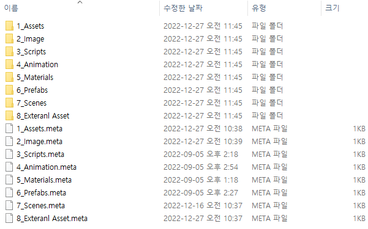

# Bullet-Survival

> Bullet Survival는 Unity2021.3.11f1 버전으로 제작한 팀 프로젝트입니다.
  **프로젝트 기간** : 2022년 9월 4일 ~ 2022년 9월 11일
  **개발 인원**    : 3명
  **게임 장르**    : 탄막 피하기
  **노션 링크**    : [노션](https://glamorous-timpani-e2c.notion.site/Unity-C-117ac0c996df4ac284e2e8bdd6b7a7f2)

:bulb:   Git-구성
------------------------
* 01_Assets 부터 08_External Asset로 공통된 폴더 명으로 작업하였습니다.
  * 프로젝트는 유니티 패키지 파일로 모델링 파일을 공유하였고, 팀장의 컴퓨터에서 작업물을 병합하였습니다.
    * 각각 팀원은 게임 기능 구현, 게임 모델링 및 배경 구현, 게임 밸런스 기획 및 시나리오 구성의 역할을 맡았습니다.

💾 김동훈 Git 작업 내역
------------------------
* Assets > 03_Scripts 폴더 안에서 제가 작업한 코드 Script를 확인할 수 있습니다.
  * Bullet
  * BulletSpawn
  * GameManager
  * PlayerController
  * SelectCharacter
  * SpawnEnemy

:nail_care: README.md Version ManageMent
------------------------

색인|버전|날짜|월|일|작업 내용
---|---|---|---|---|---|
1|V1.0|2022년|12월|27일|최초 README.md Commit
